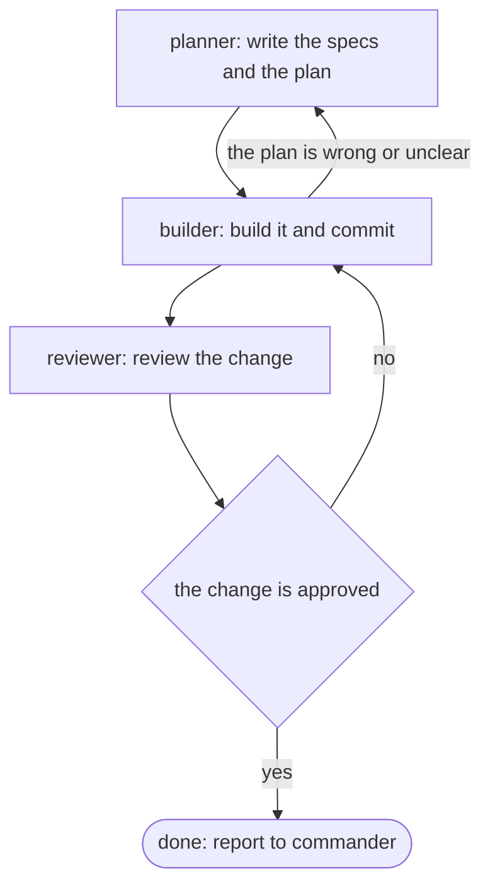

# legion

Legion runs a team of [Claude Code](https://claude.com/claude-code) sessions
in tmux, one project at a time. One session leads. The others each have a
job, like planning, building or reviewing. They talk to each other directly
to get the work done.

Everything Legion knows lives in plain files in your project's `.legion/`
folder. There's no background service and no database. You can read any of
it with `cat` and track it with git.

## Why it works well

- **You only start the commander.** Operators come up when the work reaches
  them, and go away when it no longer can. A squad might define ten
  operators, but a mission that only needs two starts only those two.
- **One set of operators, many pipelines.** Each operator has one job,
  like "review this branch" or "build this change", and doesn't care which
  pipeline sent the work. A pipeline is a short flowchart that picks which
  operators a mission goes through and in what order. Adding a new kind of
  work means writing a new flowchart, not new operators.
- **The pipeline decides who's next; the commander starts them.** When a
  step finishes, the operator reads the pipeline, names the next operator
  and hands the mission to the commander. The commander is the only one
  that starts or stops sessions, so nobody spins up a teammate by mistake.
- **Squad actions are tools.** Every session gets Legion's MCP server, with
  the actions its role allows: hand off, ask the human, report done for
  operators; start, scale and stand down for the commander. A Claude session
  outside the squad can plug in too, to check on it and answer questions.
- **Stopping is cheap.** A stood-down operator keeps its conversation, so
  starting it again later picks up where it left off.

## Words used here

Legion's commands and files use a few names. This is what each one means:

- **Squad** — the team of sessions working on one project. Each project has
  one squad, and its name comes from `.legion/legion.json`.
- **Commander** — the lead session. It decides what needs doing, hands out
  work, and settles disagreements. It doesn't tell the others how to do
  their jobs.
- **Operator** — any other session on the squad, named for its job:
  `planner`, `builder`, `reviewer`, or anything you define.
- **Mission** — one piece of work, written as a markdown file.
- **Pipeline** — a fixed order that a mission moves through, like planner,
  then builder, then reviewer.

Each session gets a fixed address, `<squad>-<name>`, for example
`myapp-builder`. Claude Code sessions can already message each other by name
(`ListAgents` / `SendMessage`). Legion sets that name when it starts the
session, so the others can always find it.

## Requirements

- [Claude Code](https://claude.com/claude-code), with `claude` on your `PATH`
- `tmux`
- `git`, `uuidgen` and `python3` (all come with macOS and most Linux systems)

## Install

```bash
curl -fsSL https://raw.githubusercontent.com/joeboylson/legion/main/install.sh | bash
```

This puts `legion` in `~/.local/bin` and its example files in
`~/.local/share/legion/templates`. If `~/.local/bin` isn't on your `PATH`,
the installer tells you.

If you have a clone of this repo, run `./install.sh` from it instead. It
installs the clone's own files, including any changes you've made. Run it
again after each change to reinstall.

## See it work: `legion demo`

```bash
legion demo
```

One command, in any terminal, and a squad paints a mural while you watch. "Signal" is an abstract circuit board in four neon colours:

- The commander splits the canvas into four tiles and starts four painter copies at once.
- Each painter draws its tile. Their traces have to meet at exact points along the seams, and two rings run through all four tiles.
- A critic checks every tile against the brief and sends back any that break the rules.
- When all four pass, the commander stitches them into `mural.html`, opens it, and stands everyone down.

It runs in a temp folder (or one you pass) with its own squad, so it never touches a project. Its operators run isolated from your own Claude Code settings, in auto mode, with the tools the demo needs already allowed, so you shouldn't get permission prompts. It takes a few minutes, and every operator runs on Sonnet, which is the model auto mode needs. It needs `claude`, `tmux`, `jq`, `git` and `python3`.

## Quickstart

```bash
cd some-project
legion init                              # creates ./.legion/
source .legion/bin/activate              # turns on legion commands in this shell
legion deploy                            # roll call: start everyone, no work yet
legion squad "ship the export feature"   # or: start commander, planner, builder, reviewer with a goal
legion roster                            # who has checked in
legion list                              # this squad's running sessions
legion grid                              # switch to the squad's tmux window
legion attach builder                    # switch to builder's tile
legion capture builder                   # print builder's screen without switching
legion stand-down builder                # stop builder and close its tile
legion stand-down                        # stop the whole squad
deactivate                               # turn legion commands off again
```

`legion src` prints the address of this repo on GitHub.

Every command needs `source .legion/bin/activate` in that shell first,
except `legion init`, `legion src`, `legion demo` (it runs in its own
throwaway folder), `legion mcp` (takes its own `--project` instead), and
`legion session` (plain tmux navigation, not squad-specific). That keeps
you from starting sessions in the wrong project. `deactivate` turns it off
again.

## Roll call

`legion deploy` with nothing after it starts the commander and every
operator that has a folder in `.legion/operators/`. Nobody gets any work.
Each operator messages the commander with its name and a line or two on
what it does. Once they've all answered, the commander prints the list in
its window and waits for you to give it something to do.

Use this to check that your operators are set up the way you expect before
you hand out real work.

## Seeing everyone at once

Every session in a squad runs in one tmux window, named after the squad,
with a tile for each session. The label at the top of each tile shows whose
it is. Legion adds a tile when a session starts, removes it when the session
stops, and re-arranges the tiles to fit.

A squad always gets its own tmux session, named `[LEGION] <squad>` — never
a window in whatever session you happen to be attached to, including if
that's a tmux session you use for everyday, unrelated work; running Legion
from inside it doesn't put the squad there too. The tag makes a squad's
session visually distinct from unrelated ones in `tmux ls` or `<prefix>
s`, and lets `legion session` group by it.

`legion grid` switches you to that window from anywhere — from inside tmux
or outside it — or attaches to it if you're outside tmux entirely. `legion
attach <name>` does the same and selects that session's tile.

Starting a squad doesn't change what's on your screen: the session is
created detached, so if you were looking at something else, you're still
looking at it — you'll just see a line like `started tmux session '[LEGION]
north' — see it with: legion grid` print in whatever pane you ran the
command from. Nothing switches over until you ask it to. When you do run
`legion grid`, that's a `tmux switch-client` under the hood: your terminal
jumps over to the squad's session entirely, since a tmux client only shows
one session at a time. Your previous session isn't closed, just no longer
what's on screen.

`legion session [name]` is the quickest way back and forth between
whatever you were doing and a squad: give it a name, or an unambiguous
part of one (the `[LEGION] ` prefix doesn't need typing — `legion session
north` still resolves), and it jumps straight there. Give it nothing and
it lists every squad running so you can pick. It's scoped to squads by
default — add `--all` to reach (or list) any tmux session, unrelated ones
included, tagged sessions still grouped first. Same
`switch-client`/`attach-session` underneath as `legion grid`, just not
tied to one particular squad. It works before you've activated any squad
and even before you've run `legion init` anywhere.

`legion session detach` gets you out of tmux entirely: it wraps `tmux
detach-client`, dropping you back to a plain shell while the tmux server,
and every session on it, keeps running untouched. Reattach later with
`tmux attach` or `legion session`.

Plain tmux does the same navigation job without any of this, if you'd
rather: `<prefix> L` (capital L) jumps to whichever session you were on
immediately before the current one — the fastest way to toggle between
exactly two. `<prefix> s` opens tmux's own session list. `<prefix> (` /
`<prefix> )` cycles through them in order. `<prefix> d` detaches, same as
`legion session detach`. (`<prefix>` is `Ctrl-b` unless you've remapped
it.)
Switching away, by any of these, doesn't stop or affect the squad — it
keeps running in its own session regardless of which one your terminal
happens to be showing.

## What's in `.legion/`

Commit `.legion/` with your project. Most of it is meant to be shared:

- `legion.json` — every squad-wide setting: the squad's name, extra
  folders, defaults for every operator, and the commander's own settings
  (see [Squad settings](#squad-settings)). Legion writes the name once at
  `init`, so every clone uses the same addresses.
- `log.md` — shared notes and decisions. The commander reads it at startup
  and keeps it up to date.
- `doctrine.md` — rules for everyone on the squad. Legion adds it to every
  session's instructions.
- `operators/<name>/` — optional setup for each operator (see below).
- `pipelines/<name>` — optional fixed orders (see below).
- `missions/todo/`, `missions/active/`, `missions/done/` — the work queue.

A few folders only make sense on your machine, and `.legion/.gitignore`
keeps them out of git:

- `local/` — the Claude Code session ID for each position. Legion uses it
  to reopen the same conversation next time.
- `roster/` — one file per operator saying whether it's running. Legion
  marks an operator as stood down rather than deleting its file, so the
  folder also records everyone who has ever been on the squad.
- `channel/` — this machine's channel to other squads, if you've opened or
  subscribed to one (see [Talking to another squad](#talking-to-another-squad-legion-channel)):
  who it's connected to, what's queued to send, its log, and `feed.jsonl`,
  the merged activity feed from every squad the channel is connected to.
- `activity.log` — every tool call any position on the squad makes, one
  JSON line each: time, position, tool, and a short summary. See
  [`legion activity`](#watching-activity-legion-activity).

### Folder trust

The first time Claude Code opens a folder, it asks whether you trust it.
A session waiting on that question never starts working, so Legion answers
it ahead of time. Before starting any session, Legion marks the project
folder as trusted in `~/.claude.json` (or `$CLAUDE_CONFIG_DIR/.claude.json`).
This is the same setting Claude Code saves when you answer yes yourself.
It needs `jq`. Without `jq`, Legion prints a warning and you answer the
question in each tile.

### Sessions pick up where they left off

The first time you start the commander or an operator, Legion creates a new
Claude Code conversation and saves its ID in `local/`. If you close that
operator and start it again, Legion reopens the same conversation instead
of starting fresh. You don't need to manage this.

### How work moves

The commander owns the work queue. Each mission is one markdown file with a
few header lines and then the description. Files are numbered, like
`0001-short-name.md`, so `ls` shows them in order. The commander writes new
missions into `todo/`. It moves a file to `active/` when it hands the
mission to someone, and to `done/` when they report back. A move is a plain
`mv`, so `git log` shows the history.

Each operator messages the commander every time it starts, including when
Legion reopens an earlier conversation, and again when it finishes a
mission. In between, operators talk to each other directly when
they need help. The commander doesn't pass those messages along. An
operator with nothing to do waits, and that's fine.

### Operators come and go with the work

Nobody has to start the whole squad. An operator starts the first time a
mission reaches it: the commander starts the first step, and each time an
operator hands off, the commander starts the next one the pipeline names.

The commander also stands operators down. Each time a mission moves on, it
checks every running operator. An operator gets stood down when it has no
mission and nothing waiting could still reach it: no step left for it and
no loop back to it. A planner goes once every mission is past planning,
but a builder stays while a failed review could still send work back. The
commander tells you each time it stands someone down, and it never stops an
operator that holds a mission.

### One worktree per mission

Operators share one project folder, so a paused mission can leave
half-finished edits where the next mission's work goes. To keep missions
apart, each mission that changes code gets its own git worktree: a
separate checkout of the project, on its own branch, inside
`.legion/worktrees/`.

- `legion mission start <number>` creates the worktree and a
  `mission/<name>` branch from whatever branch the project is on. It adds
  `worktree:`, `branch:` and `base:` lines to the mission file.
- Operators do that mission's reading, editing, testing and committing
  inside the worktree. Mission files, the roster and the log stay in the
  project's own `.legion/`.
- `legion mission finish <number>` moves the base branch up to the
  mission branch and deletes the worktree. It only does this when the base
  branch hasn't moved on since. If it has, the builder rebases the mission
  branch first, so Legion never merges anything for you.

The commander runs both commands as part of handing out and closing
missions. The project has to be a git repo.

### Messages between sessions

Sessions on a squad message each other with `legion message`, not Claude
Code's own messages between sessions. Claude Code cuts off a chain of
replies that loops back through a session it already passed. A squad
trading orders and results back and forth hits that limit quickly.

- `legion message send builder "the plan is ready"` saves the message as a
  file in `.legion/messages/builder/new/`. A full session name such as
  `myapp-builder` works too.
- Each session keeps `legion message wait` running in the background. It
  finishes when new mail arrives, and Claude Code wakes the session when a
  background command it started finishes.
- `legion message read` shows anything waiting, and `legion message log
  <name>` shows everything a position has received.

Legion adds three Claude Code hooks to every session, on top of its own
settings, so this doesn't rely on each session remembering the steps:

- **When the session tries to go idle,** it's handed any unread messages
  instead. It also can't go idle without a wait running.
- **After each tool it uses,** any new messages are added to what it sees.
- **Before a shell command,** starting the wait with a trailing `&` is turned
  back. Claude Code would stop that command to ask a person, and the
  session would sit there without hearing anything.

A message only counts as read once one of these hooks has shown it to the
session. The `messages` folder stays out of git.

## Watching activity: `legion activity`

Every session gets one more hook on top of the message ones: after each
tool call, a line is appended to `.legion/activity.log` — time, position,
tool name, and a short summary (the command, file path, search pattern or
URL, whichever the tool used). It's the one place to see what every
position on the squad is actually doing, not just what they report.

```bash
legion activity tail        # follow it live, most recent 20 lines to start
legion activity tail 100    # follow it live, starting further back
```

It's plain JSON Lines, so anything else that wants to watch — a script, a
dashboard — can just tail the file itself. `activity.log` stays out of git;
it's a live record, not something worth a commit history.

## Squad settings

`.legion/legion.json` holds everything that applies to the whole squad:

```json
{
  "squad": "q4-v2",
  "configMode": "layered",
  "model": "opus",
  "addDirs": ["/Users/me/code/shared-docs"],
  "defaults": {
    "scale": 3,
    "disallowedTools": ["Bash(git push:*)"]
  },
  "ownFolder": "notes/{operator}",
  "commander": { "model": "opus", "checkEvery": "1m" }
}
```

Only `squad` is required:

- `squad` — the squad's name. Every position is addressed as
  `<squad>-<position>`, so it must be unique among squads on this machine.
- `configMode` — `layered` or `isolated` for every session (see
  [Config mode](#config-mode)). An operator's own `configMode` wins.
- `model` — the default model for every session. Blank uses Claude Code's
  own default. An operator's own `model` wins.
- `addDirs` — extra folders every session may read and write, as full
  paths. They can be outside the project. Folders whose path differs on
  each machine go in `legion.local.json` instead (see below).
- `defaults` — settings every operator starts with, using the same keys as
  an `operator.json`. An operator's own `operator.json` goes on top: its
  `allowedTools` and `disallowedTools` are added to the defaults, and any
  other key it sets replaces the default. So one shared list of blocked
  actions lives here, and each `operator.json` holds only what's different.
- `ownFolder` — a path inside the project with `{operator}` in it. Each
  operator is blocked from editing every other operator's folder, so each
  writes only in its own and reads everyone's. Copies share their
  operator's folder. The commander isn't blocked.
- `commander` — the commander's own settings, with the same keys as an
  `operator.json` except `scale`. `defaults` doesn't apply to the commander.
  - `checkEvery` — how often the commander checks the squad and gives any
    idle operator work that doesn't wait on anyone else, like `"1m"`.

Legion checks `legion.json` against `templates/legion.schema.json` before
starting anyone, and `legion check` reports its problems along with every
`operator.json`'s.

### This machine's folders: `legion.local.json`

`legion.json` is shared through git, but each person keeps their clones in
a different place. Put those paths in `.legion/legion.local.json`, which
stays on your machine (`.legion/.gitignore` keeps it out of git):

```json
{
  "addDirs": ["/Users/me/code/other-repo", "/Users/me/code/worktrees"]
}
```

Legion adds its `addDirs` to the ones in `legion.json`. `addDirs` is the
only setting it can hold, so it can't change anything the squad shares.
It's only read when the squad has a `legion.json`, and `legion check`
checks it too.

Squads set up before `legion.json` keep working: Legion reads `.legion/squad`
and `.legion/ao` whenever `legion.json` is missing.

## Setting up an operator

An operator works fine with nothing but the mission text you give it. To
give one a lasting setup, create `.legion/operators/<name>/` with up to two
files. Each applies to that operator only, so a planner and a builder can
have completely different setups.

- `definition.md` — who the operator is: what it's good at, how it should
  work, what it must not do. Legion adds it to the operator's instructions
  every time it starts.
- `operator.json` — every setting, in one file:

```json
{
  "model": "sonnet",
  "configMode": "isolated",
  "scale": 2,
  "allowedTools": ["Edit(**/app/**)", "Bash(uv run pytest:*)"],
  "disallowedTools": ["Bash(git push:*)"],
  "settings": { "env": { "LEGION_OPERATOR": "builder" } },
  "mcpServers": { "fetch": { "command": "uv", "args": ["tool", "run", "mcp-server-fetch"] } }
}
```

All the keys are optional:

- `model` — `opus`, `sonnet`, `haiku` or a full model ID, passed to
  `claude` as `--model`. Leave it out to use the squad's `model` from
  `legion.json`, or Claude Code's own default if that's blank too.
- `configMode` — `layered` or `isolated` (explained below). Leave it out to
  use the squad's `configMode`.
- `scale` — lets the operator run as several copies at once: `true` for up
  to 5, or a number. See below.
- `allowedTools` and `disallowedTools` — Claude Code tool rules, passed as
  `--allowedTools` and `--disallowedTools`. `claude --help` explains the
  format. Allowed tools run without asking you for permission first.
  Disallowed tools are blocked. `Edit(pattern)` covers every file-editing
  tool.
- `settings` — a normal Claude Code settings object (hooks, environment
  variables), passed as `--settings`.
- `mcpServers` — MCP servers for this operator, keyed by name, passed as
  `--mcp-config`.
- `$comment` — notes for people; Legion ignores it.

Before starting an operator, Legion checks its `operator.json` against the
rules in `templates/operator.schema.json`. If anything is wrong — a key it
doesn't know, a model that isn't a word, a server with no command — it lists
every problem and doesn't start the operator. Run `legion check` to check all
of them yourself. Point your editor at the same schema file to get
suggestions while you type.

Squads set up before `operator.json` keep working with separate files
(`model`, `config-mode`, `scale`, `allowed-tools`, `disallowed-tools`,
`settings.json`, `mcp.json`). If an operator has an `operator.json`, Legion
uses only that.

To stop a planner from editing code, list your code folders in its
`disallowedTools`, for example `Edit(src/**)`, and leave the builder's
empty. You can't write "block everything except this folder." Block rules
only match the paths you list, so list each code path you want blocked.

The commander can have an `operators/commander/` folder too. Its
`definition.md` adds to the commander's built-in instructions rather than
replacing them.

Example planner, builder and reviewer folders come with Legion, in
`~/.local/share/legion/templates/operators/`. Copy one and change it, or ask
any Claude session, including the commander, to help you write one.

### Running several copies of an operator

Give an operator a `scale` setting to let the commander run more than one
copy of it, for example several builders working on separate missions at
the same time. The first copy is plain `builder`; the others are
`builder-2`, `builder-3` and so on, up to the number you set (5 if it's
`true`). Every copy uses the same folder, so they share one
definition, one set of tool rules and one settings file.

- `legion scale up builder "<mission>"` starts the next free copy, with
  that mission, in a new tile.
- `legion scale builder` shows which copies are running.
- `legion stand-down builder-2` stops one copy.

The commander does all of this on its own when independent missions are
waiting. Each copy works on one mission at a time, in that mission's own
worktree. When a pipeline hands off to an operator with copies, it goes to
a copy with no mission open, or asks the commander for another one.

### Config mode

Config mode decides whether a session also loads your own Claude Code
settings from `~/.claude`:

- `layered` (the default) — the session loads your normal user, project and
  local settings, plus the operator's own `settings.json`.
- `isolated` — the session skips your `~/.claude` settings
  (`--setting-sources project,local`). The operator's own `settings.json`
  is then the only settings file that matters.

`configMode` in `.legion/legion.json` sets the default for the whole squad.
An operator's `configMode` overrides it for that operator.

## Pipelines

Operators message each other whenever they need to. You don't have to set
that up. Use a pipeline when the same steps happen in the same order every
time and you want that route written down.

A pipeline is a Markdown file at `.legion/pipelines/<name>.md` holding a
[Mermaid flowchart](https://mermaid.js.org/syntax/flowchart.html). Each box is
a step named after the operator who does it. A diamond is a yes-or-no
question, written as a statement that's either true or false, and its arrows
are labelled `yes` and `no`. A rounded `done` box ends it. Legion never runs
the flowchart. The operators read it to work out who goes next, and GitHub
draws it as a diagram.



`legion init` writes the full rules to `.legion/pipelines/README.md`. It also
adds a note to the project's `CLAUDE.md`, so any Claude session you ask to
write a pipeline uses the same format. The example above comes with Legion in
`~/.local/share/legion/templates/pipelines/feature.md`. To send a mission
through a pipeline, add a `pipeline: <name>` line to the mission file's header.

When an operator finishes its step, it answers any question that follows and
works out who's next. It adds a note to the mission file and hands off to the
commander with the `handoff` tool. The commander then starts the next
operator, or messages it if it's already running. The mission file keeps a
record of every step.

## Legion's MCP server

Every session Legion starts gets Legion's own MCP server (`legion mcp`),
with the tools its role allows. Everything is still stored as plain files in
`.legion/`.

| Role | Tools |
|---|---|
| Operator | `handoff`, `report_done`, `ask_human`, `message`, `read_messages`, `mission_read`, `mission_note`, `mission_set`, `missions`, `list` |
| Commander | The operator tools except `handoff` and `report_done`, plus `start`, `scale_up`, `stand_down`, `capture`, `mission_create`, `mission_move`, `questions`, `answer` |
| Outside session | `status`, `send`, `questions`, `answer`, `capture`, `missions`, `mission_read`, `start_squad`, `stand_down` |

Only the commander can start, scale or stand down sessions. Legion blocks
those tools, and the matching `legion` commands, for every operator.

`legion channel` and `legion activity` aren't in this table — they're not
MCP tools yet, just `legion` commands any session can reach through its
Bash tool, same as any other shell command.

**Questions for you.** An operator's `ask_human` writes
`.legion/questions/Q-###.md`, with numbered options and a recommendation, and
tells the commander. Answer in the commander's window, or from another
session with `answer`. Either way the answer goes back to whoever asked and
into the mission file.

**From your own Claude session.** Add the server once, pointed at the
project:

```bash
claude mcp add legion -- legion mcp --role human --project /path/to/project
```

Then ask that session how the squad is doing, or tell it to answer a
question, send the commander a mission, or stand everyone down.

## Talking to another squad: `legion channel`

`legion message` is for positions on one squad. To relay to a different
squad entirely — another project on the same laptop, another machine on
your LAN, or over something like Tailscale — open a channel:

```bash
legion channel open --port 7000                  # accept connections on this port
legion channel open --port 7000 --key sekret      # only from a subscriber with this key
```

Another squad reaches it with:

```bash
legion channel subscribe <host>:7000 --team myapp --key sekret
```

Either side then relays with:

```bash
legion channel send <their-team> "the export API is ready for you to build against"
legion channel send <their-team> --operator builder "same, but straight to their builder"
```

It's delivered into the other squad's `.legion/messages/`, exactly like
`legion message send` — the same Stop/PostToolUse hooks pick it up, so an
operator hears it the way it hears anything else, tagged `from:
external:<team>`. It goes to their commander unless you name an operator.
`legion channel peers` shows every team a channel currently knows about,
with the operators each one announced.

A subscriber to your channel is also a peer of anyone else subscribed to
it: the listening side relays between the teams connected to it, not just
to itself, so one open channel can join several squads together.

**Activity crosses the channel too, automatically.** Each side of a
connection also mirrors its own [`activity.log`](#watching-activity-legion-activity)
to the other, with no `legion channel send` needed — it's the channel
daemon tailing the file itself, not anything an operator has to remember
to do. Every connected squad ends up with `.legion/channel/feed.jsonl`: one
combined, live feed of every tool call on every squad the channel reaches,
each line tagged with which team it came from. Point anything that reads
JSON Lines at that file — a script, a small web page polling it — to watch
several squads work at once.

**Reachability is a network decision, not a Legion one.** The channel
listens on every interface; whether that means only this machine, your
LAN, your tailnet, or the open internet depends on what can actually route
to that port. The key is the only access control Legion adds on top, and
it's optional — skip it when reachability alone is trust enough (localhost,
your own LAN, a tailnet you don't share with anyone else), and set one
where it isn't (anything you'd call public). There's no encryption of its
own: on an open network, put it behind something that has some (a VPN, an
SSH tunnel, Tailscale) rather than trusting the key alone.

A channel runs as its own background process (`legion-channeld`), separate
from any Claude session, so it keeps relaying and answering `legion channel
peers` even while the whole squad is stood down. `legion channel close`
stops it.

## License

MIT — see [LICENSE](LICENSE).
