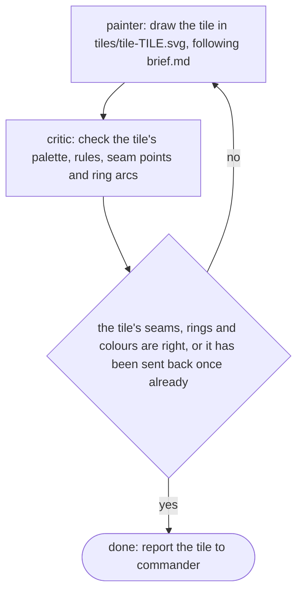

# mural

One mission per tile. The painter draws it, the critic checks it against the brief, and a tile that breaks the rules goes back to its painter. The critic sends a tile back at most once, and only for a broken seam point, ring arc or colour.

