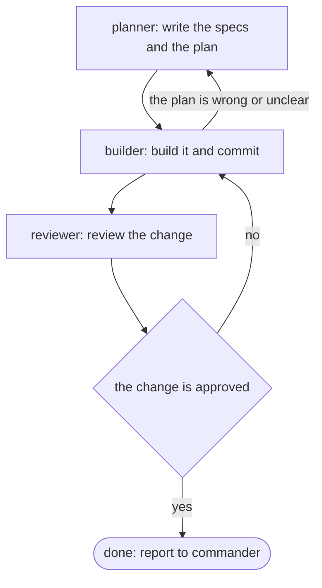

# How to write a pipeline

A pipeline is the route a mission takes through the squad. Each one is a
Markdown file in `.legion/pipelines/`, named after the pipeline: `feature.md`
is the `feature` pipeline. A mission file uses it with a `pipeline: feature`
header line.

The route is a [Mermaid flowchart](https://mermaid.js.org/syntax/flowchart.html)
inside a ```` ```mermaid ```` block. Legion never runs it. Every operator
reads it to work out who goes next, and GitHub draws it as a diagram. Write
any notes you like around the block.

## The rules

- **A step** is a box whose name is an operator: `builder[builder: build it and commit]`.
  The name before the bracket is who does the step; the text inside says what the step is.
- **The first step** is the first box in the flowchart.
- **A question** is a diamond holding a statement that is either true or false:
  `approved{the change is approved}`. The operator who just finished decides
  whether it's true.
- **Arrows out of a question** are labelled `yes` or `no`: `approved -->|yes| done`.
- **A labelled arrow out of a step** is only followed when its label is true:
  `builder -->|the plan is wrong or unclear| planner`. An unlabelled arrow is
  the normal next step.
- **The end** is a rounded box named `done`: `done([done: report to commander])`.
  Whoever reaches it reports the mission done to commander.

Keep statements plain and checkable, like "the tests pass" or "the change
touches the database". Steps can loop back, as a failed review does to builder.

## Example


