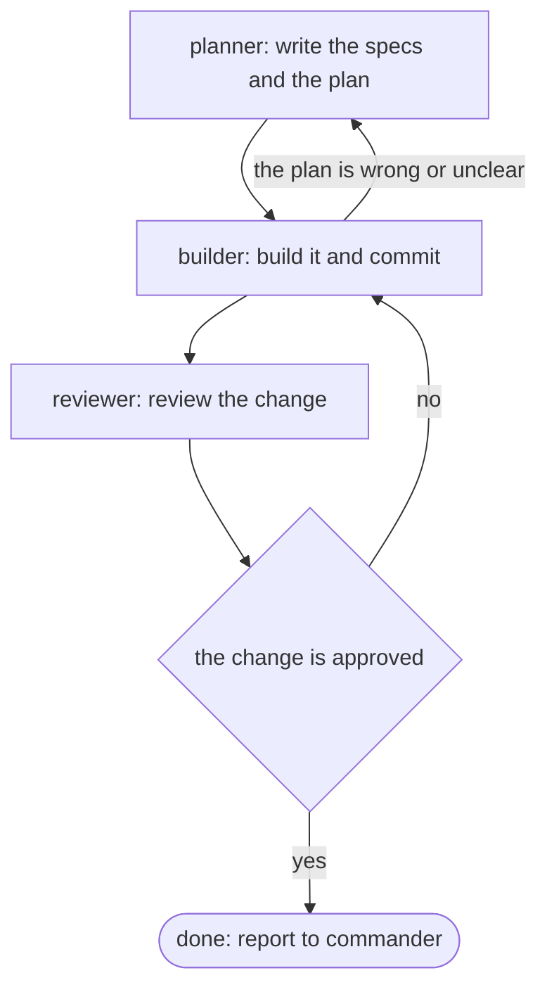

# feature

A change to how the app behaves: planner specs and plans it, builder builds
it, reviewer checks it. Give a mission file a `pipeline: feature` header to
send it through these steps without commander passing it along.

